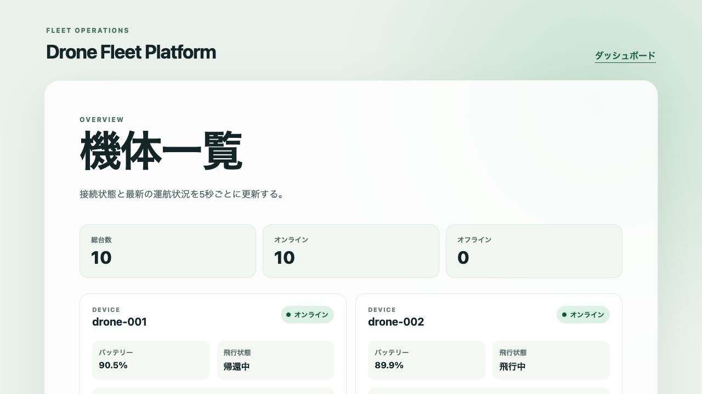
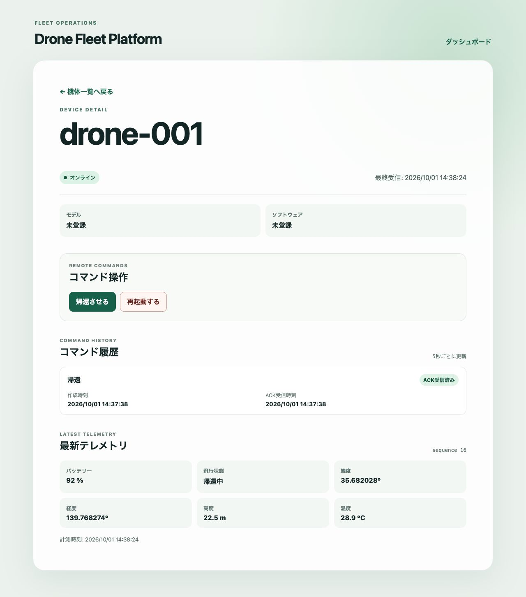
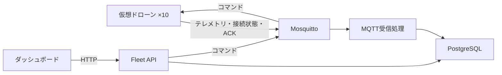

# Drone Fleet Platform

ドローンの状態監視と遠隔コマンドを扱うデバイス管理基盤。

TypeScriptで作った仮想ドローンからMQTTでデータを送り、位置やバッテリー残量、接続状態をダッシュボードで確認する。帰還・再起動コマンドの送信とACKの追跡まで、AWSアカウントや実機なしで試せる。

## 開発状況

Phase 1のローカル最小構成まで実装済みで、`v0.1.0`として次の範囲を利用できる。

- pnpm workspaceとTypeScriptの共通設定
- lint、型チェック、テスト、ビルドの共通コマンド
- GitHub Actionsによる品質チェックとシークレット検査
- Docker Composeで動かすローカル開発環境
- MQTTの送受信検証
- MQTTトピックとPhase 1メッセージの型・実行時検証
- 台数を設定できる仮想ドローンからの接続状態・テレメトリ送信・コマンド処理
- PostgreSQLへのデバイス登録とテレメトリ保存、オンライン・オフライン判定、ACK受信処理
- 登録済みデバイスの一覧・詳細・テレメトリ履歴API
- RETURN_HOME・REBOOTコマンドの送信APIとコマンド履歴API
- React・Vite・TanStack Queryによるダッシュボード基盤、機体一覧・詳細画面、コマンド操作・履歴表示
- MQTTからAPIまでの結合テストと、シードによるシミュレーションの再現

## ローカルデモ

Docker EngineとDocker Compose v2があれば、全サービスと仮想ドローン10台をまとめて起動できる。初回はイメージのビルドを含むため数分かかる場合がある。

```bash
git clone https://github.com/wmsuke/drone-fleet-platform.git
cd drone-fleet-platform
cp .env.example .env
docker compose up --build -d --wait
```

起動後に[http://localhost:5173](http://localhost:5173)を開く。機体一覧に`drone-001`から`drone-010`までが表示され、約5秒ごとにテレメトリが更新される。



コマンドとACKは次の手順で確認できる。

1. 一覧から任意の機体の「機体詳細を見る」を押す。
2. 「帰還させる」または「再起動する」を押し、確認画面から実行する。
3. コマンド履歴が「ACK受信済み」になることを確認する。画面は5秒ごとに更新される。
4. 帰還では飛行状態が「帰還中」になり、再起動では一時切断後にオンラインへ戻る。



APIから10台を確認する場合は、次のURLを使用する。

```bash
curl http://127.0.0.1:3000/devices
```

デモを終了する。PostgreSQLとMosquittoのデータはvolumeに残る。

```bash
docker compose down
```

保存データも削除して初回状態へ戻す場合は、`docker compose down --volumes`を使用する。

### 構成とデータの流れ



詳しいサービス構成は[システム構成](docs/architecture.md)、MQTTトピックとメッセージ形式は[通信仕様](docs/protocol.md)、Phaseごとの対象範囲は[ロードマップ](docs/roadmap.md)を参照する。

### v0.1.0の制約

- ローカルのDocker Compose環境を対象とし、AWS IoT Coreや実機には接続しない。
- MosquittoはComposeネットワーク内で匿名接続を許可する開発用設定であり、外部公開を想定しない。
- 操作できるコマンドは`RETURN_HOME`と`REBOOT`のみである。
- ACKは仮想ドローンがコマンドを受領したことを示し、実行完了を示すものではない。
- モデル名とソフトウェアバージョンはPhase 1のメッセージに含まれないため、画面では未登録と表示する。
- 認証・認可、通信断からの再送・復旧、OTA、ROS 2連携は後続Phaseで扱う。

## 開発環境

次のツールを使用する。

- Node.js 22以上
- Corepackから有効化するpnpm 10以上
- Docker Engine
- Docker Compose v2

Corepackを有効化し、各ツールのバージョンを確認する。

```bash
node --version
corepack enable
pnpm --version
docker --version
docker compose version
```

### セットアップ

リポジトリをcloneした後、ルートで依存関係をインストールし、共通の品質チェックを実行する。`packageManager`で指定したpnpmと、リポジトリのlockfileを使用する。

```bash
pnpm install --frozen-lockfile
pnpm check
```

ローカルサービス用の設定項目を確認する場合は、サンプルをコピーする。

```bash
cp .env.example .env
```

サンプル値はローカル開発専用である。シミュレータは起動時に`.env`からMQTT接続先、台数、シード、送信間隔を読み込む。ブローカー単体の送受信検証に`.env`は必要ない。設定項目と秘密情報の扱いは[環境変数と秘密情報](docs/environment.md)を参照する。

個別のコマンドは次のとおり。

| コマンド                   | 内容                                       |
| -------------------------- | ------------------------------------------ |
| `pnpm check`               | lint、型チェック、テスト、ビルドを順に実行 |
| `pnpm lint`                | ESLintとPrettierによる静的検査             |
| `pnpm typecheck`           | 全workspaceの型チェック                    |
| `pnpm test`                | Vitestによるテスト                         |
| `pnpm build`               | 全workspaceのビルド                        |
| `pnpm load:local`          | ローカルMQTT向け負荷生成器                 |
| `pnpm test:load-report`    | 負荷試験レポートの小規模E2E                |
| `pnpm verify:mqtt`         | Mosquittoの起動とMQTT送受信を検証          |
| `pnpm test:telemetry-path` | MQTTからAPIまでの結合テスト                |

Pull Requestと`main`ブランチへのpushでは、GitHub Actionsが`pnpm check`、テレメトリ経路の結合テスト、負荷試験レポートの小規模E2Eを実行する。

### 負荷生成器

`apps/load-generator`は通常のシミュレータとは別に、指定範囲のdeviceIdからローカルMosquittoへテレメトリを送る。AWS固有の接続処理は含まない。件数上限または時間上限に達すると送信を止め、MQTT接続を閉じて`LOAD_REPORT_PATH`へJSONレポートを保存する。

```bash
docker compose -f compose.yaml -f compose.dev.yaml up -d --wait mqtt

LOAD_TEST_ID=local-100 \
LOAD_SESSION_ID=worker-1 \
LOAD_DEVICE_START=1 \
LOAD_DEVICE_COUNT=100 \
LOAD_CONNECTION_RATE_PER_SECOND=25 \
LOAD_TELEMETRY_INTERVAL_MS=1000 \
LOAD_SIMULATION_SEED=demo-seed \
LOAD_MAX_MESSAGES=10000 \
LOAD_MAX_DURATION_MS=60000 \
LOAD_REPORT_PATH=load-results/local-100-worker-1.json \
pnpm load:local
```

deviceIdは`load-000001`の形式で、`LOAD_DEVICE_START`から`LOAD_DEVICE_COUNT`台を割り当てる。複数プロセスでは開始位置が重ならないように指定する。たとえば100台ずつ分ける場合、1つ目を開始位置1、2つ目を101とする。`LOAD_CONNECTION_RATE_PER_SECOND`は1秒あたりの新規接続数である。

レポートには試験ID、セッションID、全設定、開始・終了時刻、停止理由、送信試行・成功・失敗数、機体ごとの最終sequenceを記録する。テレメトリ本体は[通信仕様](docs/protocol.md)のproduction schemaをそのまま使い、試験IDなどは追加しない。負荷検証全体の方針とAWSの費用上限は[負荷検証の提案](docs/proposals/load-testing.md)を参照する。

telemetry-ingestor側の受信・検証・DB保存を計測する場合は、`.env`で次を設定してからingestorを起動する。通常起動では`LOAD_METRICS_ENABLED=false`のため計測処理は動かない。

```dotenv
LOAD_METRICS_ENABLED=true
LOAD_TEST_ID=local-100
LOAD_SESSION_ID=ingestor-1
LOAD_METRICS_REPORT_PATH=load-results/local-100-ingestor-1-ingestor.json
```

ingestorの停止時にJSONレポートを保存する。レポートではMQTT受信、protocol検証、DB保存の成功・失敗を別々に数え、device timestampからMQTT受信までの遅延と、MQTT受信からDB transaction完了までの時間を別のヒストグラムへ記録する。ヒストグラムは固定bucketの非累積件数、合計、最小、最大を保持し、p50/p95/p99を近似集計できる。負の受信遅延も送受信ホスト間の時計ずれとして捨てずに記録する。

generator、ingestor、PostgreSQLの結果を同じtestIdで突き合わせる小規模E2Eは次で実行する。

```bash
pnpm test:load-report
```

専用Compose projectでPostgreSQL、Mosquitto、telemetry-ingestor、APIを起動し、deviceId範囲を分けた2つのgeneratorを並行実行する。集約レポートには送信、受信、検証、DB保存、実保存、欠損、OFFLINE遷移の件数と、受信遅延・DB保存時間のp50/p95/p99を記録する。DBの照合はgenerator sessionごとのdeviceIdとdevice timestampの範囲で行うため、別sessionでsequenceが0へ戻っても混在しない。件数が一致しない場合はsession別の送信・保存・欠損数を表示して失敗する。成功・失敗を問わずComposeのコンテナ、ネットワーク、volumeと一時ディレクトリを削除する。

## 全サービスの一括起動

Docker ComposeでPostgreSQL、Mosquitto、DBマイグレーション、MQTT受信処理、API、仮想ドローン10台、ダッシュボードを起動する。Node.jsやpnpmをホストへインストールしていない場合も、Docker EngineとDocker Compose v2があれば起動できる。

```bash
cp .env.example .env
docker compose up --build -d --wait
```

初回起動ではPostgreSQLとMosquittoのhealthcheck完了後にDBマイグレーションを自動適用する。マイグレーションが正常終了してからMQTT受信処理とAPIを起動し、APIのhealthcheck完了後にダッシュボードを起動する。起動状態は次のコマンドで確認できる。`migrate`だけは処理完了後に`Exited (0)`となるのが正常である。

```bash
docker compose ps -a
docker compose logs migrate
```

[http://localhost:5173](http://localhost:5173)を開くと、`drone-001`から`drone-010`までの状態を確認できる。APIは`http://127.0.0.1:3000`で利用できる。PostgreSQLとMosquittoは通常の一括起動ではホストへ公開せず、Composeネットワーク内だけで使用する。

全サービスを停止してコンテナとネットワークを削除する。PostgreSQLとMosquittoのデータはvolumeへ残るため、同じコマンドで再起動できる。

```bash
docker compose down
docker compose up -d --wait
```

保存データも削除して初回起動の状態へ戻す場合は、次のコマンドを使用する。

```bash
docker compose down --volumes
```

ログをまとめて確認する場合は次のコマンドを使用する。

```bash
docker compose logs -f
```

### テレメトリ経路の結合テスト

シミュレータを1台起動し、生成したテレメトリがMosquitto、MQTT受信処理、PostgreSQLを経由してAPIへ到達することを検証する。あわせて、固定テレメトリをMosquittoへ送信し、APIから取得した全項目が一致することを確認する。

```bash
pnpm test:telemetry-path
```

テストは専用のComposeプロジェクトを使用する。固定テレメトリとシミュレータのテレメトリは、それぞれAPIへの反映を最大30秒待つ。成功・失敗を問わずコンテナ、ネットワーク、volumeを削除する。失敗時はPostgreSQL、Mosquitto、マイグレーション、MQTT受信処理、シミュレータ、APIの状態とログを出力する。外部のAWSや実機には接続しない。Pull Requestと`main`へのpushでも同じテストを実行する。

ダッシュボードの開発サーバーは、`.env`の`VITE_API_BASE_URL`を接続先として起動する。

```bash
pnpm --filter @drone-fleet/dashboard dev
```

`pnpm test`は各workspaceの単体テストを実行する。

### Phase 0の確認結果

Phase 0完了時に次の環境とコマンドで確認した。バージョンは検証時点の記録であり、前提条件の下限を変更するものではない。

| 項目                                       | 確認結果          |
| ------------------------------------------ | ----------------- |
| Node.js                                    | v22.22.3          |
| pnpm                                       | 10.28.1           |
| Docker Engine                              | 28.0.4            |
| Docker Compose                             | v2.34.0-desktop.1 |
| `pnpm install --frozen-lockfile`           | 成功              |
| `pnpm check`                               | 成功（テスト0件） |
| `pnpm verify:mqtt`                         | 成功              |
| `docker compose ps` / `logs mqtt` / `down` | 成功              |

## 個別サービスの開発

PostgreSQLやMosquittoへホスト側の開発コマンドから接続する場合は、`compose.dev.yaml`を追加してlocalhostへポートを公開する。

```bash
docker compose -f compose.yaml -f compose.dev.yaml up -d --wait postgres mqtt
```

### ローカルMQTTブローカー

Docker ComposeでMosquittoだけを起動する。

```bash
docker compose up -d mqtt
docker compose ps
```

ブローカーのログを確認する場合は次のコマンドを使用する。`-f`を付けるとログを継続的に表示できる。

```bash
docker compose logs mqtt
docker compose logs -f mqtt
```

ローカル開発だけで利用するため、`localhost:1883`で匿名接続を許可している。外部へ公開した環境では使用しない。

起動、検証専用トピックの購読と送信、受信内容の検証をまとめて実行するには、次のコマンドを使用する。送受信を確認できない場合は終了コードが非0になる。検証後もMosquittoは起動したままになるため、不要になったら後述のコマンドで停止する。

```bash
pnpm verify:mqtt
```

手動で確認する場合は、最初のターミナルで購読を開始する。

```bash
docker compose exec mqtt mosquitto_sub -h localhost -t fleet/test
```

別のターミナルからメッセージを送信すると、購読側に`hello`が表示される。

```bash
docker compose exec mqtt mosquitto_pub -h localhost -t fleet/test -m hello
```

### 仮想ドローンの起動

`.env.example`をコピーし、Mosquittoを起動する。

```bash
cp .env.example .env
docker compose -f compose.yaml -f compose.dev.yaml up -d mqtt
```

最初のターミナルで全機体のテレメトリを購読する。`-v`によりトピックへ含まれるdeviceIdを識別できる。

```bash
docker compose exec mqtt mosquitto_sub -v -h localhost \
  -t 'fleet/v1/devices/+/telemetry'
```

別のターミナルでシミュレータを起動する。`DRONE_COUNT`の既定値は10で、`drone-001`から`drone-010`が起動する。各機体は起動直後にONLINEとテレメトリを送信し、以後は約5秒ごとにテレメトリを送信する。

```bash
pnpm --filter @drone-fleet/simulator... build
node --env-file=.env apps/simulator/dist/index.js
```

台数を変更する場合は`.env`の`DRONE_COUNT`へ1〜1000の整数を指定する。不正な値では起動せずエラーを表示する。1000台規模の性能はPhase 1の保証対象外とする。

`SIMULATION_SEED`へ1〜128文字のシードを指定すると、同じシード、台数、deviceId、sequenceから同じ状態系列を再現できる。未指定時は`default`を使用する。時刻は実際のメッセージ作成時刻を使うため再現対象に含まれない。別の系列を確認する場合はシードを変更する。

```dotenv
SIMULATION_SEED=demo-2026
```

シミュレータを`Ctrl+C`で終了すると、全機体がOFFLINE / SHUTDOWNをretain付きで送信してからMQTT接続を閉じる。購読側のJSONは`packages/protocol`の`connectionStatusMessageSchema`と`telemetryMessageSchema`で検証できる。

確認後はブローカーを停止する。

```bash
docker compose down
```

保存データも削除する場合は、代わりに次のコマンドを使用する。

```bash
docker compose down --volumes
```

### PostgreSQLの起動と初期化

`.env.example`をコピーし、空のPostgreSQLを起動する。

```bash
cp .env.example .env
docker compose -f compose.yaml -f compose.dev.yaml up -d --wait postgres
```

Drizzleのマイグレーションを適用する。再実行しても適用済みのマイグレーションは重複実行されない。

```bash
pnpm db:migrate
```

DB制約を含むintegration testは、PostgreSQL起動後に次のコマンドで実行する。

```bash
DATABASE_INTEGRATION=true pnpm db:test:integration
```

MQTT受信処理のテレメトリ保存を実DBで確認する場合は、次のintegration testを実行する。テスト内で既存デバイスを用意し、有効なテレメトリだけが保存されることを確認する。

```bash
DATABASE_INTEGRATION=true pnpm telemetry:test:integration
```

スキーマを変更した場合は、変更内容を確認してから新しいSQLマイグレーションを生成する。

```bash
pnpm db:generate
```

DBを空の状態へ戻す場合は、PostgreSQLを停止してデータ用volumeを削除する。

```bash
docker compose down --volumes
```

## 設計と開発計画

- [システム構成](docs/architecture.md)
- [通信仕様](docs/protocol.md)
- [ロードマップ](docs/roadmap.md)
- [環境変数と秘密情報](docs/environment.md)
- [開発ルール](AGENTS.md)
- [ADR 0001: pnpmでTypeScriptのモノレポを構成する](docs/adr/0001-monorepo.md)
- [ADR 0002: デバイスとの通信にMQTTを使う](docs/adr/0002-mqtt-protocol.md)
- [ADR 0003: 初期の保存先にPostgreSQLを使う](docs/adr/0003-database.md)

## ライセンス

このプロジェクトは[MIT License](LICENSE)の下で公開している。
