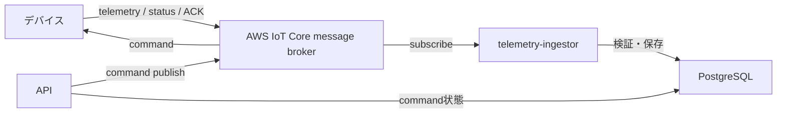

# ADR 0004: AWS IoT Coreへ既存サービスを直接MQTT接続する

- 状態: 採用
- 決定日: 2026-10-02

## 背景

Phase 2では、ローカルのMosquitto構成を維持したままAWS IoT Core経由の双方向通信を追加する。テレメトリ、接続状態、ACKを既存の受信・保存処理へ渡し、APIからコマンドを送れる必要がある。同時に、デバイスごとの認証、topic単位の認可、秘密鍵とTerraform stateの安全な管理が必要になる。

Phase 2.5ではBasic IngestとIoT Ruleを使った短時間のクラウド経路確認を行う。通常運用の双方向通信と負荷確認では目的が異なるため、同じ経路として扱うかを決める必要がある。

## 決定

通常運用では、telemetry-ingestorとAPIがAWS IoT Coreのmessage brokerへそれぞれMQTT over TLSで直接接続する。新しいCloud Adapterサービスは追加しない。

- telemetry-ingestorはテレメトリ、接続状態、ACKを購読し、既存の検証・保存処理へ渡す。
- APIはコマンド作成後、既存のpublisher interfaceからAWS IoT Coreへコマンドを送る。
- デバイス、telemetry-ingestor、APIは別々のX.509証明書とIoT Policyを使う。
- 接続先、mTLS設定、clientId、再接続処理だけをtransport固有とする。
- topic、payload、QoS、retain、実行時検証、DB処理はMosquittoとAWS IoT Coreで共通にする。

### サービスの責務

| 対象                      | 共通にする処理                                      | AWS固有の処理                                    |
| ------------------------- | --------------------------------------------------- | ------------------------------------------------ |
| `packages/protocol`       | topic生成・解析、メッセージの型と検証               | なし                                             |
| `apps/simulator`          | 状態生成、メッセージ生成、コマンド処理              | mTLS接続設定とデバイス証明書の読み込み           |
| `apps/telemetry-ingestor` | topicと本文の照合、検証、DB保存、オンライン判定     | ATS endpointへのmTLS接続、バックエンド用clientId |
| `apps/api`                | コマンド作成、状態更新、publisher interface         | ATS endpointへのmTLS接続、バックエンド用clientId |
| Terraform                 | Thing、IoT Policy、証明書との関連付け、endpoint出力 | AWSリソース全般                                  |

transportの選択は設定で行う。`local`では従来どおりMosquittoへ接続し、証明書を要求しない。`aws-iot`ではATS endpoint、Amazon Root CA、クライアント証明書、秘密鍵を要求する。HTTP API、DB schema、ダッシュボードから見た振る舞いは変えない。

### 通信経路

| 種類         | 経路                                                                       |
| ------------ | -------------------------------------------------------------------------- |
| telemetry    | デバイス → AWS IoT Core → telemetry-ingestor → PostgreSQL                  |
| status / LWT | デバイスまたはAWS IoT Core → telemetry-ingestor → PostgreSQL               |
| command      | Dashboard → API → PostgreSQLへ`PENDING`保存 → AWS IoT Core → デバイス      |
| ACK          | デバイス → AWS IoT Core → telemetry-ingestor → PostgreSQLのcommand状態更新 |

MQTTへのpublish成功を確認してからcommandを`SENT`へ進める。DB保存とMQTT publishは単一transactionではないため、既存と同じく`FAILED`、ACK timeout、ACK先行をアプリケーションで扱う。

### Thing、clientId、証明書、Policyの対応

デバイスは次の関係を1対1にする。

- Thing name: `deviceId`
- MQTT clientId: `deviceId`
- X.509証明書: デバイスごとに1枚
- IoT Policy: Thingへ関連付けた証明書にattach

デバイスPolicyは、固定したclientIdでの接続、自分のtelemetry・status・ACKのpublish、自分宛てcommandのsubscribe・receiveだけを許可する。`${iot:ClientId}`だけを信用せず、`iot:Connect`のresourceに`${iot:Connection.Thing.ThingName}`を使い、`iot:Connection.Thing.IsAttached`が`true`であることを条件にする。他機体のtopicとワイルドカードclientIdは許可しない。

バックエンドはThingとして登録せず、サービスごとに証明書と固定clientIdを分ける。

| サービス           | clientId                                       | 権限                                        |
| ------------------ | ---------------------------------------------- | ------------------------------------------- |
| telemetry-ingestor | `drone-fleet-<environment>-telemetry-ingestor` | telemetry・status・ACKのsubscribe / receive |
| API                | `drone-fleet-<environment>-api`                | commandのpublish                            |

バックエンド証明書をデバイスと共有せず、telemetry-ingestorとAPIの間でも共有しない。侵害時は対象サービスまたは対象機体の証明書だけを無効化・交換できるようにする。

### 認証情報の管理

秘密鍵はクライアント側で生成し、外部へ出さない。Phase 2の初期実装では、Git管理外の`secrets/`に所有者だけが読める権限で置き、CSRをAWS IoT Coreへ登録する。Terraformは秘密鍵、証明書本文、秘密値を生成・出力しない。

- Gitへ秘密鍵、証明書、`.env`、実値入り`*.tfvars`、Terraform stateを追加しない。
- `.env`には認証情報の内容ではなく、Git管理外ファイルへのパスだけを書く。
- Terraformには既存のcertificate ARNを変数で渡し、Thing、Policy、attachmentを管理する。
- Terraform stateにはARNやresource IDなどの非秘密メタデータは残るが、秘密鍵と証明書本文は残さない。
- ローカルstateはGit管理外とし、所有者だけが読める権限にする。共有stateが必要になった場合は、暗号化、versioning、public access block、最小権限、lockingを備えたbackendへ移行する。
- ログ、CI artifact、Issue、PR、負荷試験レポートへ秘密鍵と証明書本文を出力しない。
- 廃止時はPolicyとThingの関連付けを外し、証明書を`INACTIVE`にしてから削除する。漏えい時は対象証明書を直ちに無効化し、新しい鍵と証明書へ交換する。

Amazon Root CAは公開情報だが、デバイス証明書と秘密鍵の誤配置を防ぐため、証明書関連ファイルをまとめてGit管理外とする。本番の大規模provisioningやhardware-backed key storageはPhase 2の初期範囲に含めず、台数と運用要件が決まった時点でFleet Provisioningなどを検討する。

### Phase 2.5のBasic Ingestとの関係

Basic Ingestは`$aws/rules/<ruleName>/...`へpublishしてmessage brokerを迂回するため、通常運用の受信経路には採用しない。通常運用はstatusのretainとLWT、commandのsubscribe、ACKを含む双方向通信を必要とするためである。

Phase 2.5では、テレメトリの短時間負荷確認だけにBasic Ingestと一時的なIoT Ruleを使う。通常運用とは証明書、Policy、topic prefixを分け、試験後にRuleと関連リソースを削除する。productionのtopic suffixとpayload schemaは共通にする。

## 理由

- 現在のtelemetry-ingestorとAPIはMQTTの受信と送信をすでに分担しており、brokerをAWS IoT Coreへ切り替えても責務を保てる。
- IoT Rule、Lambda、SQSなどを通常経路へ追加せず、Phase 2の変更範囲とAWS利用料を抑えられる。
- Cloud Adapterとの内部通信方式や追加の障害点を設計せずに済む。
- サービスごとの証明書と最小権限Policyにより、侵害範囲とローテーション対象を限定できる。
- MosquittoとAWS IoT Coreで`packages/protocol`を共有し、AWS projectなしでローカル開発とCIを継続できる。

## 採用しなかった案

### Basic IngestとIoT Ruleを通常の受信経路にする

Basic Ingestはmessage brokerを迂回する一方向の取り込みに適するが、statusのretain・LWT、command配信、ACKを含む現在の双方向MQTTを単一経路で扱えない。後段にLambda、SQS、HTTP endpointなどが必要になり、課金対象と運用箇所も増えるため採用しない。

### Cloud Adapterを独立サービスとして追加する

AWS固有処理を1か所へ隔離できる一方、APIからAdapterへcommandを渡す内部API、queue、またはDB outboxが必要になる。Phase 2時点では、サービス追加による障害点と整合性設計の増加が分離の効果を上回るため採用しない。複数cloud brokerへの対応や認証方式の追加が決まった場合に再検討する。

### APIのcommand送信だけをLambdaやIoT Data Plane APIへ移す

受信経路と異なる認証・再試行・監視が必要になり、ローカルとの実装差も広がる。既存のpublisher interfaceをMQTT接続の実装差し替えに使う方が変更範囲を限定できるため採用しない。

### 1枚の証明書を全デバイスとバックエンドで共有する

漏えい時の影響範囲が全体へ広がり、機体単位の無効化と最小権限Policyを実現できないため採用しない。

### Terraformで秘密鍵を生成・保持する

秘密鍵がstate、plan、CI artifactへ残る可能性があるため採用しない。Terraformは公開側リソースと関連付けだけを管理する。

## AWS利用料への影響

Phase 2で確認対象になるのは、AWS IoT Coreの接続時間、message brokerのpublish・delivery、retained message、RegistryのThing・証明書・Policy操作、データ転送である。CloudWatch Logsを診断のため有効にする場合は、その取り込みと保存も対象になる。

Phase 2.5のBasic IngestではIoT Ruleの起動とaction、action先サービス、republishしたmessage brokerのmessageが対象になる。Lambda、SQS、Kinesis、RDS、EC2、Secrets Manager、KMS、remote Terraform backend用S3などを追加する場合は、それぞれ別に料金とFree Tierを確認する。AWS Budgetsは通知手段であり、自動停止手段として扱わない。

## トレードオフ

- telemetry-ingestorとAPIがそれぞれAWS IoT Core接続を持つため、mTLS設定、再接続、証明書ローテーションを2サービスで扱う必要がある。
- APIのプロセス停止中はcommandをpublishできない。永続outboxと自動再送はPhase 3で検討する。
- 初期の秘密鍵管理は単一開発環境のGit管理外ファイルであり、本番の集中管理やhardware-backed key storageではない。
- AWS IoT CoreとMosquittoのMQTT実装差は、結合テストで継続的に確認する必要がある。

## 実装結果と影響

Phase 2では、このADRを前提に次を実装した。

1. #92: Thing、バックエンド用IoT Policy、endpoint出力のTerraform。
2. #93: Git管理外で鍵を生成し、CSRから証明書を登録・無効化・削除する手順。
3. #94: Thingと証明書の対応に基づくデバイス単位のIoT Policyとcertificate attachment。
4. #95、#96、#97: simulator、telemetry-ingestor、APIのtransport設定とmTLS接続。
5. #98: 他機体topicの拒否、telemetry / status / command / ACKのAWS結合テスト。
6. #99: 作成・削除手順、利用料確認、v0.2.0の検証済み範囲。

環境作成、証明書発行、E2E、証明書失効、環境削除は[AWS IoT Core接続手順](../aws/README.md)を入口とする。Phase 2で確認したのは手動の発行・失効であり、証明書の自動ローテーションとFleet Provisioningは未実装である。

## 参照

- [ADR 0002: デバイスとの通信にMQTTを使う](0002-mqtt-protocol.md)
- [通信仕様](../protocol.md)
- [AWS IoT Core security best practices](https://docs.aws.amazon.com/iot/latest/developerguide/security-best-practices.html)
- [X.509 client certificates](https://docs.aws.amazon.com/iot/latest/developerguide/x509-client-certs.html)
- [Thing policy variables](https://docs.aws.amazon.com/iot/latest/developerguide/thing-policy-variables.html)
- [Reducing messaging costs with Basic Ingest](https://docs.aws.amazon.com/iot/latest/developerguide/iot-basic-ingest.html)
