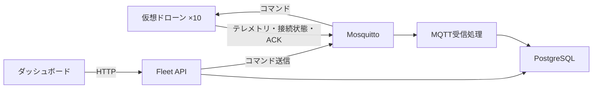

# システム構成

## 開発範囲

最初はAWSを使わず、仮想ドローン10台をローカルで動かす。各機体からテレメトリを受信・保存し、ダッシュボードで状態を確認する。帰還と再起動のコマンドを送り、受領確認まで追跡する。

AWS接続や通信断対応は後続のPhaseで追加する。AWS対応後も、ローカルだけで動作する構成を維持する。

Phase 0では、TypeScriptのモノレポ、各サービスのプレースホルダー、Mosquitto、共通検証コマンド、CIを実装した。テレメトリ、データ保存、HTTP API、シミュレータ、ダッシュボードはPhase 1で実装する。

## Phase 1のローカル構成


```mermaid
flowchart LR
    Simulator["仮想ドローン ×10"]
    Broker["Mosquitto"]
    Ingestor["MQTT受信処理"]
    DB["PostgreSQL"]
    API["Fleet API"]
    Dashboard["ダッシュボード"]

    Simulator -->|"テレメトリ・接続状態・ACK"| Broker
    Broker --> Ingestor
    Ingestor --> DB
    Dashboard -->|"HTTP"| API
    API --> DB
    API -->|"コマンド送信"| Broker
    Broker -->|"コマンド"| Simulator
```

Phase 1では、Docker Composeで以下を起動する。Phase 0の`compose.yaml`に含まれるのはMosquittoのみである。

- Mosquitto
- PostgreSQL
- シミュレータ
- MQTT受信処理
- API
- ダッシュボード

シミュレータは1つのアプリ内で複数の仮想機体を動かす。機体ごとに異なるdeviceIdとMQTT接続を持たせる。

## 技術スタック

| 領域 | 使用技術 | 状態 |
|---|---|---|
| 言語・実行環境 | TypeScript / Node.js | Phase 0で導入済み |
| モノレポ | pnpm workspace | Phase 0で導入済み |
| HTTP API | Fastify | Phase 1で導入予定 |
| 入力検証 | Zod | Phase 1で導入予定 |
| データベース | PostgreSQL | Phase 1で導入予定 |
| ORM・マイグレーション | Drizzle ORM | Phase 1で導入予定 |
| MQTTクライアント | mqtt.js | Phase 1で導入予定 |
| MQTTブローカー | Eclipse Mosquitto | Phase 0で導入済み |
| フロントエンド | React / Vite / TanStack Query | Phase 1で導入済み |
| テスト | Vitest | Phase 0で実行基盤を導入済み、機能テストは未実装 |
| 画面のE2Eテスト | Playwright | Phase 1で導入予定 |
| ローカル実行 | Docker Compose | Phase 0でMosquittoに使用 |
| CI | GitHub Actions | Phase 0で導入済み |
| 静的検査・整形 | ESLint / Prettier | Phase 0で導入済み |

導入済みのバージョンは設定ファイルと`pnpm-lock.yaml`に記録する。Phase 1以降の依存ライブラリは、導入時に互換性を確認してバージョンを決める。

## ディレクトリ構成

```text
apps/
├── api/
├── telemetry-ingestor/
├── simulator/
└── dashboard/

packages/
├── protocol/
├── database/
└── config/

infra/
└── local/

docs/
├── adr/
│   ├── 0001-monorepo.md
│   ├── 0002-mqtt-protocol.md
│   └── 0003-database.md
├── architecture.md
├── environment.md
├── protocol.md
└── roadmap.md

scripts/
├── scan-secrets.sh
└── verify-mqtt.sh
```

Phase 0の開発基盤に加え、Phase 1の通信仕様、仮想ドローン、DBスキーマ、テレメトリ保存、HTTP API、ダッシュボード、全サービスのDocker Compose構成を実装済みである。以下の機能はIssue単位で追加する。`infra/terraform`はPhase 2で追加する。

### apps/api

デバイス一覧・詳細・テレメトリ履歴・コマンド送信・コマンド履歴APIを実装済みである。一覧は各deviceをdeviceId順で返し、接続状態と最新テレメトリの概要を取得できる。詳細はdeviceの基本情報と最新テレメトリの全項目を返す。テレメトリ履歴は受信時刻、コマンド履歴は作成時刻の新しい順に返し、どちらも既定100件、`limit`で最大1000件まで指定できる。コマンド送信はPENDINGでDBへ保存してからQoS 1、retainなしでMQTTへ送信し、結果をSENTまたはFAILEDへ更新する。状態更新はPENDINGの行だけを対象とし、先に届いたACKによるACKNOWLEDGEDを上書きしない。

- デバイス一覧・詳細の取得
- テレメトリ履歴の取得
- コマンドの受付とMQTT送信
- コマンド履歴の取得（実装済み）

コマンドの送信処理はHTTPの処理から分離するが、初期段階では独立したサービスにはしない。

### apps/telemetry-ingestor

テレメトリ、接続状態、ACKトピックの購読、通信仕様による検証、初回受信時のデバイス登録、テレメトリ保存、LWTと最終受信時刻によるオンライン・オフライン判定、ACKによるコマンド状態更新を実装済みである。

- 初回受信時のデバイス登録（実装済み）
- テレメトリの保存（実装済み）
- 接続状態と最終受信時刻の更新
- ACKによるコマンド状態の更新（実装済み）

不正なメッセージは保存せず、原因をログに残す。

### apps/simulator

設定した台数の仮想ドローンからの接続状態とテレメトリ送信、コマンド受信を実装済みである。

- 約5秒ごとのテレメトリ送信
- 接続状態の通知
- バッテリー残量、位置、高度、温度の変化
- 自機宛てコマンドの受信とACKの送信
- RETURN_HOMEによる飛行状態の変更
- REBOOTによる正常切断と再接続後のONLINE通知

`DRONE_COUNT`で起動台数を指定し、既定値は10台とする。deviceIdは`drone-001`から連番で割り当て、機体ごとに独立したMQTTクライアントを使用する。1000台規模の動作保証はPhase 1に含めない。

機体状態はテレメトリのsequenceを時間ステップとして決定論的に計算する。バッテリーは1ステップにつき0.5ポイント減少して0で下げ止まり、緯度・経度は東京駅付近の半径0.001度、高度は0〜50m、温度は20〜30℃の範囲を40ステップ周期で変化させる。同じsequenceからは常に同じ状態を生成する。

### apps/dashboard

React、Vite、TanStack Query、React Routerによる画面基盤と機体一覧・詳細画面、コマンド操作・履歴表示を実装済みである。API接続先は`VITE_API_BASE_URL`で指定し、未設定、読み込み中、通信失敗を画面に表示する。ローカル開発で別originになるAPIは、`DASHBOARD_ORIGIN`と一致するダッシュボードだけにCORSレスポンスを返す。一覧、詳細、コマンド履歴は5秒ごとに更新する。一覧は総台数、オンライン・オフライン台数、各機体の接続状態と最新値を表示し、詳細は位置、高度、温度を含む最新テレメトリを単位付きで表示する。詳細画面から帰還または再起動コマンドを確認後に送信でき、再起動は通信断への明示的な同意を必要とする。送信中は操作を無効化し、結果を画面に表示する。コマンド履歴には種類、状態、作成時刻、ACK受信時刻を表示し、送信直後と5秒ごとに更新する。APIからデータを取得し、MQTTやDBには直接接続しない。

- 総台数とオンライン・オフラインの台数（実装済み）
- 各機体の接続状態、バッテリー残量、最終受信時刻（実装済み）
- 位置、高度、温度、飛行状態（実装済み）
- 帰還・再起動の操作（実装済み）
- コマンド履歴と受領状態（実装済み）

### packages/protocol

Phase 1で、デバイスと基盤の間で共有する通信仕様を実装する。

- MQTTトピック
- メッセージの型
- Zodによる実行時検証
- プロトコルのバージョン

詳細は[通信仕様](protocol.md)に記載する。

### packages/database

Phase 1で、DBスキーマ、接続処理、マイグレーションを配置する。APIとMQTT受信処理から利用する。

### packages/config

Phase 0でTypeScriptの共通設定を実装した。各workspaceは`@drone-fleet/config/tsconfig.base.json`を継承し、固有の設定は各workspaceで管理する。

### infra

`local`にはMosquittoのローカル設定を置く。ルートの`compose.yaml`はPostgreSQLとMosquittoのhealthcheck、DBマイグレーション、MQTT受信処理、API、仮想ドローン、ダッシュボードの起動順を管理する。通常はAPIとダッシュボードだけをlocalhostへ公開する。ホスト側の開発コマンドでPostgreSQLとMosquittoへ接続するときは`compose.dev.yaml`を併用する。停止時は依存関係と逆の順序でサービスを終了し、シミュレータと各サービスが接続を閉じてから基盤サービスを停止する。Phase 2以降のAWS環境に使用する`terraform`は未作成である。

`scripts/test-telemetry-path.sh`は専用のComposeプロジェクトでPostgreSQL、Mosquitto、DBマイグレーション、MQTT受信処理、シミュレータ1台、APIを起動する。シミュレータが生成したテレメトリがAPIへ到達することに加え、固定テレメトリをMQTTへ送信してAPIのテレメトリ履歴で全項目が一致することを、それぞれ上限時間付きで待つ。失敗時は経路上のサービス状態とログを出力し、終了時はテスト用データとプロセスを削除する。

## Phase 1のデータの流れ

### テレメトリ

1. 仮想ドローンがMQTTでテレメトリを送信する。
2. MQTT受信処理がメッセージを検証する。
3. デバイス情報とテレメトリをDBへ保存する。
4. ダッシュボードがAPIを通じて取得する。

### コマンド

1. ダッシュボードからAPIへコマンドを送る。
2. APIがコマンドをDBに記録する。
3. APIが対象機体のMQTTトピックへ送信する。
4. 仮想ドローンが受信し、同じcommandIdのACKを返す。
5. MQTT受信処理がコマンドの状態を更新する。
6. ダッシュボードで受領状態を確認する。

ACKはコマンドの受領を示す。帰還や再起動の完了とは区別する。

DB保存とMQTT送信は単一のトランザクションにはならない。ACKが送信結果の更新より先に届いてもACKNOWLEDGEDを維持し、TIMED_OUT後に届いたACKはタイムアウト時刻を残したままACKNOWLEDGEDへ更新する。

## Phase 1で保存するデータ

Phase 1では、次の3テーブルを使用する。

| テーブル | 内容 |
|---|---|
| devices | デバイスID、モデル、ソフトウェアバージョン、接続状態、最終受信時刻、登録・更新時刻 |
| telemetry | デバイスID、連番、デバイス計測時刻、サーバー受信時刻、バッテリー残量、位置、高度、温度、飛行状態 |
| commands | コマンドID、対象デバイス、種類、処理状態、作成・送信・ACK受信・タイムアウト時刻 |

接続状態は`devices.connection_status`、飛行状態は`telemetry.flight_status`として別に管理する。テレメトリのsequenceはプロセス再起動で0へ戻るため一意制約には使わず、機体とsequence、および機体と受信時刻の複合インデックスを持つ。コマンドは機体と作成時刻、状態と作成時刻のインデックスを持つ。

初めて受信したdeviceIdは`devices`の主キーとupsertを使って登録する。同じdeviceIdの同時受信でも1行だけを保持する。`last_received_at`と`updated_at`は既存値と受信時刻の大きい方を保存し、並行処理の完了順によって時刻が戻らないようにする。Phase 1のメッセージには機体情報がないため、`model`と`software_version`は初期値を`null`とする。

## Phase 1の接続状態の判定

接続時はONLINEを通知する。予期しない切断はMQTTのLWTでOFFLINEを通知する。

通知だけに依存せず、最終受信時刻からの経過時間も使って判定する。通常のONLINE通知またはテレメトリ受信でONLINE、OFFLINE通知または既定15秒の未受信でOFFLINEとする。閾値は`OFFLINE_TIMEOUT_MS`で変更できる。購読直後に届くretainedのONLINE通知だけでは現在も接続中とは確認できないため、未知deviceの登録だけを行い、接続状態と最終受信時刻は更新しない。防御的にretainedのテレメトリも同様に扱う。

## 設計の理由

### Phase 0ではサービスの境界から作る

Phase 1の機能を先回りせず、各アプリと共通パッケージの配置、TypeScriptの共通設定、ビルド経路だけを用意した。これにより、サービス間の責務を保ったままIssue単位で機能を追加できる。

### ComposeはMosquittoから始める

Phase 0ではMQTTブローカーの起動と送受信に範囲を絞った。`compose.yaml`へのPostgreSQLと各アプリの追加は、実装と起動条件が確定するPhase 1で行う。Mosquittoは`127.0.0.1:1883`にのみ公開し、匿名接続をローカル開発に限定する。

### MQTT受信とHTTP APIを分ける

デバイスからの受信処理と、画面からの要求処理では責務が異なる。分離することで、AWS接続の追加時に受信経路を変更しやすくする。

### 通信仕様を共有する

シミュレータと受信側で型や検証処理がずれることを防ぐため、通信仕様を共通パッケージで管理する。

### PostgreSQLから始める

デバイス、テレメトリ、コマンドの保存先を揃え、ローカルで再現できる構成にする。

### Fastifyを使う

HTTPの入出力と、DB操作やMQTT送信を分けて実装する。初期段階では大きなフレームワークや独自の抽象化を増やさない。

## AWSへの拡張

Phase 2ではAWS IoT Coreへの接続を追加する。

- デバイスごとのIDと証明書
- mTLS接続
- IoT Policyによる権限制御
- クラウド側の受信処理とコマンド送信
- Terraformによる環境構築

ローカルのMosquitto構成も残し、共通の通信仕様を使う。AWS側の受信処理にはIoT RuleやLambdaなどを検討し、具体的な構成はPhase 2で決める。

## 負荷検証

継続的な性能限界はローカル構成で測る。AWS IoT Coreでは、無料利用枠の範囲で証明書認証、接続レート、同時接続、クラウド経路を短時間確認する。

負荷生成器は、試験ID、セッションID、担当するdeviceIdの範囲、接続レート、送信間隔、最大送信件数、最大実行時間を指定できる構成とする。送信試行・成功・失敗を記録し、ingestorの受信・検証・保存結果と突き合わせる。

AWS向け実行では月間200,000件を自主上限とし、当月の使用済み件数を差し引いた残量を超える設定を拒否する。AWS Budgetsは通知に使い、停止は負荷生成器の件数と時間の上限で行う。無料利用枠の対象期間と残量を確認できない場合はAWS試験を実行しない。

計測条件、指標、合格条件、AWSで実行する短時間シナリオは[負荷検証の提案](proposals/load-testing.md)に記載する。

## 後続Phaseで扱うこと

- 通信断中のローカル保存と再送
- メッセージの重複排除
- 複数機体への一括操作
- OTAと段階的な配信
- ROS 2との接続
- 運用ログを使ったAIによる調査支援

実装順序と完了条件は[ロードマップ](roadmap.md)に記載する。

## 関連ADR

- [ADR 0001: pnpmでTypeScriptのモノレポを構成する](adr/0001-monorepo.md)
- [ADR 0002: デバイスとの通信にMQTTを使う](adr/0002-mqtt-protocol.md)
- [ADR 0003: 初期の保存先にPostgreSQLを使う](adr/0003-database.md)
