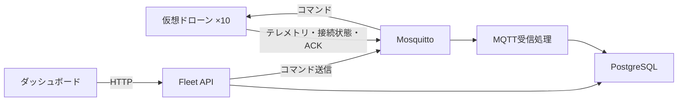

# システム構成

## 開発範囲

最初はAWSを使わず、仮想ドローン10台をローカルで動かす。各機体からテレメトリを受信・保存し、ダッシュボードで状態を確認する。帰還と再起動のコマンドを送り、受領確認まで追跡する。

AWS接続や通信断対応は後続のPhaseで追加する。AWS対応後も、ローカルだけで動作する構成を維持する。

Phase 0では、TypeScriptのモノレポ、各サービスのプレースホルダー、Mosquitto、共通検証コマンド、CIを実装した。テレメトリ、データ保存、HTTP API、シミュレータ、ダッシュボードはPhase 1で実装する。

## Phase 1のローカル構成


```mermaid
flowchart LR
    Simulator["仮想ドローン ×10"]
    Broker["Mosquitto"]
    Ingestor["MQTT受信処理"]
    DB["PostgreSQL"]
    API["Fleet API"]
    Dashboard["ダッシュボード"]

    Simulator -->|"テレメトリ・接続状態・ACK"| Broker
    Broker --> Ingestor
    Ingestor --> DB
    Dashboard -->|"HTTP"| API
    API --> DB
    API -->|"コマンド送信"| Broker
    Broker -->|"コマンド"| Simulator
```

Phase 1では、Docker Composeで以下を起動する。Phase 0の`compose.yaml`に含まれるのはMosquittoのみである。

- Mosquitto
- PostgreSQL
- シミュレータ
- MQTT受信処理
- API
- ダッシュボード

シミュレータは1つのアプリ内で複数の仮想機体を動かす。機体ごとに異なるdeviceIdとMQTT接続を持たせる。

## 技術スタック

| 領域 | 使用技術 | 状態 |
|---|---|---|
| 言語・実行環境 | TypeScript / Node.js | Phase 0で導入済み |
| モノレポ | pnpm workspace | Phase 0で導入済み |
| HTTP API | Fastify | Phase 1で導入予定 |
| 入力検証 | Zod | Phase 1で導入予定 |
| データベース | PostgreSQL | Phase 1で導入予定 |
| ORM・マイグレーション | Drizzle ORM | Phase 1で導入予定 |
| MQTTクライアント | mqtt.js | Phase 1で導入予定 |
| MQTTブローカー | Eclipse Mosquitto | Phase 0で導入済み |
| フロントエンド | React / Vite / TanStack Query | Phase 1で導入予定 |
| テスト | Vitest | Phase 0で実行基盤を導入済み、機能テストは未実装 |
| 画面のE2Eテスト | Playwright | Phase 1で導入予定 |
| ローカル実行 | Docker Compose | Phase 0でMosquittoに使用 |
| CI | GitHub Actions | Phase 0で導入済み |
| 静的検査・整形 | ESLint / Prettier | Phase 0で導入済み |

導入済みのバージョンは設定ファイルと`pnpm-lock.yaml`に記録する。Phase 1以降の依存ライブラリは、導入時に互換性を確認してバージョンを決める。

## ディレクトリ構成

```text
apps/
├── api/
├── telemetry-ingestor/
├── simulator/
└── dashboard/

packages/
├── protocol/
├── database/
└── config/

infra/
└── local/

docs/
├── adr/
│   ├── 0001-monorepo.md
│   ├── 0002-mqtt-protocol.md
│   └── 0003-database.md
├── architecture.md
├── environment.md
├── protocol.md
└── roadmap.md

scripts/
├── scan-secrets.sh
└── verify-mqtt.sh
```

これはPhase 0終盤の現在の構成である。`apps`と`packages`にはビルド可能なプレースホルダーのみを置き、以下の機能はPhase 1で実装する。`infra/terraform`はPhase 2で追加する。

### apps/api

Phase 1で、デバイス情報の取得とコマンド送信を扱うHTTP APIを実装する。

- デバイス一覧・詳細の取得
- テレメトリ履歴の取得
- コマンドの受付とMQTT送信
- コマンド履歴の取得

コマンドの送信処理はHTTPの処理から分離するが、初期段階では独立したサービスにはしない。

### apps/telemetry-ingestor

Phase 1で、MQTTメッセージを受信し、検証してDBへ保存する。

- 初回受信時のデバイス登録
- テレメトリの保存
- 接続状態と最終受信時刻の更新
- ACKによるコマンド状態の更新

不正なメッセージは保存せず、原因をログに残す。

### apps/simulator

Phase 1で、仮想ドローンの状態と通信を再現する。

- 約5秒ごとのテレメトリ送信
- 接続状態の通知
- バッテリー残量、位置、高度、温度の変化
- コマンド受信とACKの送信

`DRONE_COUNT`で台数を設定する。初期の動作確認は10台で行う。

### apps/dashboard

Phase 1で、APIからデータを取得し、機体一覧と詳細を表示する。MQTTやDBには直接接続しない。

- 総台数とオンライン・オフラインの台数
- 各機体の接続状態、バッテリー残量、最終受信時刻
- 位置、高度、温度、飛行状態
- 帰還・再起動の操作
- コマンド履歴と受領状態

### packages/protocol

Phase 1で、デバイスと基盤の間で共有する通信仕様を実装する。

- MQTTトピック
- メッセージの型
- Zodによる実行時検証
- プロトコルのバージョン

詳細は[通信仕様](protocol.md)に記載する。

### packages/database

Phase 1で、DBスキーマ、接続処理、マイグレーションを配置する。APIとMQTT受信処理から利用する。

### packages/config

TypeScriptなどの共通設定を配置する。各アプリ固有の設定は各アプリで管理する。

### infra

`local`にはMosquittoのローカル設定を置く。Phase 1でローカルサービスの構成を追加する。Phase 2以降のAWS環境に使用する`terraform`は未作成である。

## Phase 1のデータの流れ

### テレメトリ

1. 仮想ドローンがMQTTでテレメトリを送信する。
2. MQTT受信処理がメッセージを検証する。
3. デバイス情報とテレメトリをDBへ保存する。
4. ダッシュボードがAPIを通じて取得する。

### コマンド

1. ダッシュボードからAPIへコマンドを送る。
2. APIがコマンドをDBに記録する。
3. APIが対象機体のMQTTトピックへ送信する。
4. 仮想ドローンが受信し、同じcommandIdのACKを返す。
5. MQTT受信処理がコマンドの状態を更新する。
6. ダッシュボードで受領状態を確認する。

ACKはコマンドの受領を示す。帰還や再起動の完了とは区別する。

DB保存とMQTT送信は単一のトランザクションにはならない。送信失敗やACKが届かない場合の状態と扱いは、コマンド実装時に定義する。

## Phase 1で保存するデータ

Phase 1では、次の3テーブルを使用する。

| テーブル | 内容 |
|---|---|
| devices | デバイスID、モデル、ソフトウェアバージョン、接続状態、最終受信時刻 |
| telemetry | デバイスID、連番、計測時刻、バッテリー残量、位置、高度、温度、飛行状態 |
| commands | コマンドID、対象デバイス、種類、処理状態、作成時刻、ACK受信時刻 |

接続状態と飛行状態は別の情報として管理する。カラム名、制約、インデックスはDBの実装時に確定する。

## Phase 1の接続状態の判定

接続時はONLINEを通知する。予期しない切断はMQTTのLWTでOFFLINEを通知する。

通知だけに依存せず、最終受信時刻からの経過時間も使って判定する。初期案は15秒だが、閾値と状態の優先順位は通信仕様で確定する。

## 設計の理由

### Phase 0ではサービスの境界から作る

Phase 1の機能を先回りせず、各アプリと共通パッケージの配置、TypeScriptの共通設定、ビルド経路だけを用意した。これにより、サービス間の責務を保ったままIssue単位で機能を追加できる。

### ComposeはMosquittoから始める

Phase 0ではMQTTブローカーの起動と送受信に範囲を絞った。`compose.yaml`へのPostgreSQLと各アプリの追加は、実装と起動条件が確定するPhase 1で行う。Mosquittoは`127.0.0.1:1883`にのみ公開し、匿名接続をローカル開発に限定する。

### MQTT受信とHTTP APIを分ける

デバイスからの受信処理と、画面からの要求処理では責務が異なる。分離することで、AWS接続の追加時に受信経路を変更しやすくする。

### 通信仕様を共有する

シミュレータと受信側で型や検証処理がずれることを防ぐため、通信仕様を共通パッケージで管理する。

### PostgreSQLから始める

デバイス、テレメトリ、コマンドの保存先を揃え、ローカルで再現できる構成にする。

### Fastifyを使う

HTTPの入出力と、DB操作やMQTT送信を分けて実装する。初期段階では大きなフレームワークや独自の抽象化を増やさない。

## AWSへの拡張

Phase 2ではAWS IoT Coreへの接続を追加する。

- デバイスごとのIDと証明書
- mTLS接続
- IoT Policyによる権限制御
- クラウド側の受信処理とコマンド送信
- Terraformによる環境構築

ローカルのMosquitto構成も残し、共通の通信仕様を使う。AWS側の受信処理にはIoT RuleやLambdaなどを検討し、具体的な構成はPhase 2で決める。

## 後続Phaseで扱うこと

- 通信断中のローカル保存と再送
- メッセージの重複排除
- 複数機体への一括操作
- OTAと段階的な配信
- ROS 2との接続
- 運用ログを使ったAIによる調査支援

実装順序と完了条件は[ロードマップ](roadmap.md)に記載する。

## 関連ADR

- [ADR 0001: pnpmでTypeScriptのモノレポを構成する](adr/0001-monorepo.md)
- [ADR 0002: デバイスとの通信にMQTTを使う](adr/0002-mqtt-protocol.md)
- [ADR 0003: 初期の保存先にPostgreSQLを使う](adr/0003-database.md)
